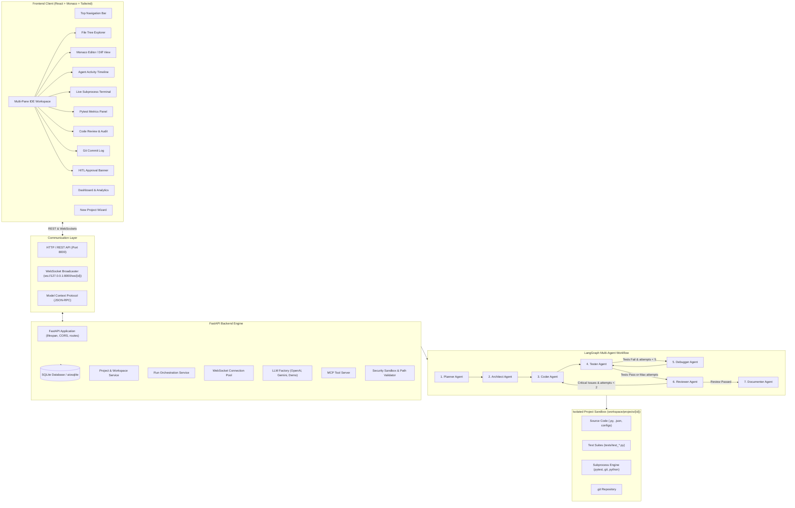

# 🤖 Autonomous AI Software Engineer Agent — Full Technical Documentation & Architecture Reference

Welcome to the complete documentation for the **Autonomous AI Software Engineer Agent Workspace**. This document provides an exhaustive, end-to-end technical reference for the entire system, covering architecture, multi-agent workflows, backend services, frontend IDE components, sandbox security, Model Context Protocol (MCP) integrations, REST/WebSocket APIs, database schemas, and operational instructions.

---

## 📑 Table of Contents

1. [System Overview & High-Level Architecture](#1-system-overview--high-level-architecture)
2. [Directory & Repository Structure](#2-directory--repository-structure)
3. [LangGraph Multi-Agent Orchestration Engine](#3-langgraph-multi-agent-orchestration-engine)
   - [Agent State Schema](#agent-state-schema)
   - [Workflow State Graph & Branching Logic](#workflow-state-graph--branching-logic)
   - [Specialized Agent Nodes](#specialized-agent-nodes)
   - [Automated Debugging Feedback Loop](#automated-debugging-feedback-loop)
4. [Backend Architecture & Services](#4-backend-architecture--services)
   - [Application Entrypoint & Lifespan](#application-entrypoint--lifespan)
   - [Configuration Management (`config.py`)](#configuration-management-configpy)
   - [Database Layer & SQLAlchemy Models](#database-layer--sqlalchemy-models)
   - [Project Service & Workspace Isolation](#project-service--workspace-isolation)
   - [Run Service & Orchestration Controller](#run-service--orchestration-controller)
   - [WebSocket Real-Time Event Broadcaster](#websocket-real-time-event-broadcaster)
   - [LLM Factory & Multi-Provider Support](#llm-factory--multi-provider-support)
   - [Deterministic Zero-Setup Mock Engine](#deterministic-zero-setup-mock-engine)
5. [Security Sandbox & Execution Engine](#5-security-sandbox--execution-engine)
   - [Path Traversal Prevention](#path-traversal-prevention)
   - [Forbidden Commands & Pattern Matching](#forbidden-commands--pattern-matching)
   - [Human-in-the-Loop (HITL) Interceptions](#human-in-the-loop-hitl-interceptions)
   - [Real Subprocess & Pytest Runner](#real-subprocess--pytest-runner)
6. [Model Context Protocol (MCP) Server](#6-model-context-protocol-mcp-server)
   - [Exposed Tools Manifest](#exposed-tools-manifest)
   - [Tool Invocation Flow](#tool-invocation-flow)
   - [External Client Integration (Cursor, Claude Desktop, VS Code)](#external-client-integration)
7. [REST API & WebSocket Protocol Reference](#7-rest-api--websocket-protocol-reference)
   - [REST Endpoints](#rest-endpoints)
   - [WebSocket Channels & Event Payloads](#websocket-channels--event-payloads)
8. [Frontend Developer IDE Workspace (React + Monaco)](#8-frontend-developer-ide-workspace-react--monaco)
   - [UI Architecture & State Management](#ui-architecture--state-management)
   - [Dashboard View & Metrics](#dashboard-view--metrics)
   - [New Project Wizard & Templates](#new-project-wizard--templates)
   - [Multi-Pane IDE Layout](#multi-pane-ide-layout)
   - [Monaco Editor & Side-by-Side Diff Viewer](#monaco-editor--side-by-side-diff-viewer)
   - [Agent Pipeline Timeline](#agent-pipeline-timeline)
   - [Dockable Live ANSI Terminal](#dockable-live-ansi-terminal)
   - [Pytest Diagnostics & Metrics Panel](#pytest-diagnostics--metrics-panel)
   - [Code Review & Security Audit Panel](#code-review--security-audit-panel)
   - [Git Commit History Panel](#git-commit-history-panel)
   - [Human-in-the-Loop Approval Banner](#human-in-the-loop-approval-banner)
   - [MCP Exporter & Settings Views](#mcp-exporter--settings-views)
9. [Setup, Execution & Deployment Guide](#9-setup-execution--deployment-guide)
   - [System Prerequisites](#system-prerequisites)
   - [Backend Installation & Startup](#backend-installation--startup)
   - [Frontend Installation & Startup](#frontend-installation--startup)
   - [Running Automated Unit Tests](#running-automated-unit-tests)
10. [Troubleshooting & FAQ](#10-troubleshooting--faq)

---

## 1. System Overview & High-Level Architecture

The **Autonomous AI Software Engineer Agent** is a full-stack platform that transforms high-level natural language requirements into fully realized, tested, documented, and git-versioned software projects within isolated workspaces.

Unlike conventional code generation tools that simply output a wall of text, this system operates as an autonomous development team. It plans requirements, designs file architectures, generates modular source files, runs actual `pytest` suites via sandboxed subprocesses, analyzes failure tracebacks, executes iterative debug loops, conducts automated security and code quality reviews, creates documentation, and commits code to Git milestones.

### Architecture Diagram



---

## 2. Directory & Repository Structure

The repository is organized into distinct backend and frontend applications with a shared sandboxed workspace:

```
peoject/
├── backend/                               # Python FastAPI Backend & Agent Engine
│   ├── app/
│   │   ├── __init__.py
│   │   ├── config.py                      # Pydantic BaseSettings (paths, LLM models, timeouts)
│   │   ├── database.py                    # Async SQLAlchemy engine & session factory
│   │   ├── main.py                        # FastAPI app initialization, CORS, routers & health check
│   │   ├── agents/                        # Multi-Agent LangGraph components
│   │   │   ├── __init__.py
│   │   │   ├── state.py                   # AgentState TypedDict definition
│   │   │   ├── graph.py                   # StateGraph definition & conditional edges
│   │   │   ├── planner.py                 # Task decomposition & acceptance criteria
│   │   │   ├── architect.py               # File tree & interface specification
│   │   │   ├── coder.py                   # Source code generation & file writing
│   │   │   ├── tester.py                  # Pytest suite synthesis & execution trigger
│   │   │   ├── debugger.py                # Stacktrace analysis & automated code patching
│   │   │   ├── reviewer.py                # Security & style static audit
│   │   │   ├── documenter.py              # Project README & API documentation
│   │   │   └── mock_engine.py             # Deterministic zero-API-key generator engine
│   │   ├── mcp/                           # Model Context Protocol Tool Server
│   │   │   ├── __init__.py
│   │   │   └── server.py                  # MCPServer manifest & JSON-RPC dispatcher
│   │   ├── models/                        # SQLAlchemy ORM Database Models
│   │   │   ├── __init__.py
│   │   │   └── models.py                  # Project, AgentRun, AgentMessage, TestResult, etc.
│   │   ├── routes/                        # FastAPI Route Handlers
│   │   │   ├── projects.py                # Project CRUD, start/stop run, export zip, approvals
│   │   │   ├── files.py                   # File tree, file read/write endpoints
│   │   │   ├── settings.py                # LLM config, security settings & stats endpoints
│   │   │   ├── ws.py                      # WebSocket connection endpoint
│   │   │   └── mcp.py                     # MCP tools and invocation routes
│   │   ├── schemas/                       # Pydantic request/response schemas
│   │   │   ├── __init__.py
│   │   │   └── schemas.py                 # DTO schemas for API input validation
│   │   ├── services/                      # Application Business Logic
│   │   │   ├── project_service.py         # Workspace directory creation, file IO, Git lifecycle
│   │   │   ├── run_service.py             # Background execution manager & WS event streamer
│   │   │   ├── llm_factory.py             # LangChain client builder (OpenAI / Gemini / Demo)
│   │   │   └── websocket_manager.py       # Pub/Sub connection manager for WebSocket clients
│   │   └── tools/                         # Sandboxed System Tools
│   │       ├── __init__.py
│   │       ├── security.py                # Path validation & forbidden command blacklists
│   │       ├── workspace_tools.py         # File creation, read, update, delete, search, tree
│   │       ├── command_tools.py           # Subprocess command runner with timeout & capture
│   │       ├── test_tools.py              # Pytest execution & stdout/traceback regex parser
│   │       └── git_tools.py               # Git init, commit, log & diff utilities
│   ├── tests/                             # Backend Pytest Test Suite
│   │   ├── conftest.py                    # Test fixtures, temp workspaces, async client setup
│   │   ├── test_agents.py                 # Unit tests for agent nodes and StateGraph
│   │   ├── test_projects_api.py           # API integration tests for CRUD and runs
│   │   ├── test_security.py               # Security sandbox and path traversal tests
│   │   └── test_tools.py                  # Unit tests for workspace, git, and pytest tools
│   ├── requirements.txt                   # Backend Python dependencies
│   ├── run.py                             # Backend development launcher script
│   └── autonomous_agent.db                # SQLite application database
│
├── frontend/                              # React + TypeScript + Monaco Developer IDE
│   ├── src/
│   │   ├── App.tsx                        # Main application component & view switcher
│   │   ├── main.tsx                       # React DOM root entrypoint
│   │   ├── index.css                      # Tailwind CSS imports & global scrollbar styling
│   │   ├── types/
│   │   │   └── index.ts                   # TypeScript interfaces (Project, AgentRun, FileNode, etc.)
│   │   ├── services/
│   │   │   ├── api.ts                     # Axios REST client with typed endpoints
│   │   │   └── websocket.ts               # Resilient WebSocket connection manager with reconnect
│   │   └── components/
│   │       ├── layout/
│   │       │   └── Navbar.tsx             # Top navigation, status indicator & quick demo launch
│   │       ├── dashboard/
│   │       │   └── DashboardView.tsx      # Project grid, build metrics & quick action buttons
│   │       ├── wizard/
│   │       │   └── NewProjectWizard.tsx   # Project creation modal, template cards & LLM options
│   │       ├── ide/                       # IDE Workspace Subcomponents
│   │       │   ├── IDEWorkspace.tsx       # Multi-pane layout container & state coordinator
│   │       │   ├── FileExplorer.tsx       # Nested tree file browser with icons and search
│   │       │   ├── CodeEditor.tsx         # Monaco Editor with syntax highlighting & Diff view
│   │       │   ├── AgentTimeline.tsx      # Step-by-step agent progress & state badges
│   │       │   ├── TerminalPanel.tsx      # Real-time ANSI command and output viewer
│   │       │   ├── TestResultsPanel.tsx   # Pytest pass/fail counts, duration & tracebacks
│   │       │   ├── CodeReviewPanel.tsx    # Code review issues list with severity filters
│   │       │   ├── GitPanel.tsx           # Commit history log with hashes and timestamps
│   │       │   └── ApprovalBanner.tsx     # HITL Approve/Deny prompt for sensitive operations
│   │       ├── settings/
│   │       │   └── SettingsView.tsx       # System preferences, API keys & security config
│   │       └── mcp/
│   │           └── MCPView.tsx            # Model Context Protocol viewer & JSON configs
│   ├── package.json                       # Frontend dependencies & npm scripts
│   ├── tsconfig.json                      # TypeScript compiler configuration
│   ├── vite.config.ts                     # Vite build configuration & backend proxy rules
│   └── tailwind.config.js                 # Tailwind CSS theme & dark mode configuration
│
├── workspace/                             # Sandboxed Project Storage Root
│   └── projects/                          # Individual generated project directories
│       └── {project_id}/                  # Isolated sandbox for each project
│
└── README.md                              # Project overview & quick start guide
```

---

## 3. LangGraph Multi-Agent Orchestration Engine

The orchestration engine is built on **LangGraph**, providing a stateful, cyclic execution graph with conditional branches and feedback loops.

### Agent State Schema

The central state object (`AgentState`) travels across all nodes in the graph:

```python
class AgentState(TypedDict, total=False):
    project_id: str
    run_id: str
    workspace_root: str
    requirement: str
    project_name: str
    options: Dict[str, Any]
    
    # LLM Configuration
    llm_provider: str          # "demo" | "openai" | "gemini"
    api_key: Optional[str]
    model: Optional[str]
    temperature: float
    
    # Workflow Intermediate Artifacts
    plan: Dict[str, Any]
    architecture: Dict[str, Any]
    files_created: List[str]
    current_task: Optional[str]
    current_agent: str
    
    # Testing & Debugging
    test_results: Dict[str, Any]
    debug_attempts: int
    max_debug_attempts: int
    
    # Review & Documentation
    review_results: List[Dict[str, Any]]
    documentation: str
    git_commits: List[str]
    
    # Status & Approvals
    pending_approval: Optional[Dict[str, Any]]
    status: str                # "running" | "completed" | "failed" | "paused"
    error: Optional[str]
```

---

### Workflow State Graph & Branching Logic

```
   [START]
      │
      ▼
┌──────────────┐
│ Planner Node │
└──────┬───────┘
       │
       ▼
┌────────────────┐
│ Architect Node │
└──────┬─────────┘
       │
       ▼
┌──────────────┐
│  Coder Node  │ ◄─────────────────────────┐
└──────┬───────┘                           │ (Critical Security
       │                                   │  Issues & Attempts < 2)
       ▼                                   │
┌──────────────┐                           │
│ Tester Node  │ ◄──────────┐              │
└──────┬───────┘            │              │
       │                    │              │
       ├───[ Tests Fail & ──┴──────────┐   │
       │    Attempts < 5 ]             │   │
       │                         ┌─────┴───┴──────┐
       │                         │ Debugger Node  │
       │                         └────────────────┘
       │
       └───[ Tests Pass OR ────────────┐
            Max Attempts Reached ]     │
                                       ▼
                              ┌─────────────────┐
                              │  Reviewer Node  │
                              └────────┬────────┘
                                       │
                                       ├───[ Review Passed ]
                                       │         │
                                       │         ▼
                                       │  ┌───────────────────┐
                                       │  │  Documenter Node  │
                                       │  └─────────┬─────────┘
                                       │            │
                                       ▼            ▼
                                    [ END (Completed) ]
```

---

### Specialized Agent Nodes

#### 1. Planner Agent (`planner.py`)
- **Objective:** Analyzes raw natural-language user requirements and creates a structured breakdown of tasks, dependencies, and acceptance criteria.
- **Output:** JSON object containing `project_name`, `description`, `requirements`, `tasks`, `dependencies`, and `acceptance_criteria`.
- **Milestone:** Sets `current_agent = "planner"`, updates progress in database, and broadcasts to WebSocket clients.

#### 2. Architect Agent (`architect.py`)
- **Objective:** Converts the plan into a complete architectural specification, defining the file tree, module responsibilities, public interfaces, database schemas, and dependencies.
- **Milestone:** Creates initial skeleton files in the workspace (e.g., `requirements.txt`, `README.md`), initializes the local Git repository, and commits the initial architecture blueprint.

#### 3. Coder Agent (`coder.py`)
- **Objective:** Synthesizes clean, production-ready Python source files according to the architectural specification.
- **Actions:** Generates application modules (e.g., FastAPI routes, SQLAlchemy/Pydantic models, core services, database connections) and writes them to the sandboxed workspace.
- **Milestone:** Creates atomic Git commit: `"Implement core application models, schemas, and routes"`.

#### 4. Tester Agent (`tester.py`)
- **Objective:** Generates comprehensive Pytest test suites covering positive cases, negative validation, edge cases, and API status codes.
- **Actions:** Writes test files (e.g., `tests/test_api.py`), then triggers genuine execution via `run_project_pytest`. Captures standard output, error codes, and traceback blocks.
- **Milestone:** Creates Git commit `"Add automated pytest test suite"` and broadcasts test metrics.

#### 5. Debugger Agent (`debugger.py`)
- **Objective:** Invoked automatically when test execution yields failures.
- **Actions:** 
  1. Inspects failed assertions, exception types, and traceback lines from pytest stdout/stderr.
  2. Diagnoses root causes in source files.
  3. Modifies and rewrites the offending source code.
  4. Increments `debug_attempts` counter.
  5. Routes back to the **Tester Node** to re-run the test suite.
- **Milestone:** Creates Git commit `"Debugger: Fix test failure (Iteration #N)"`.

#### 6. Reviewer Agent (`reviewer.py`)
- **Objective:** Performs automated code review and security audit on the entire generated workspace.
- **Evaluation Criteria:**
  - Security vulnerabilities (SQL injection, unsafe shell calls, exposed secrets, path traversal).
  - Exception handling and logging completeness.
  - Type annotations and PEP 8 style adherence.
- **Output:** Structured list of findings with `file`, `line`, `severity` (`critical`, `high`, `medium`, `low`, `info`), `issue`, and `recommendation`.
- **Conditional Edge:** If a `critical` severity finding is discovered and debug attempts `< 2`, the workflow can route back to the **Coder Node** for remediation.

#### 7. Documenter Agent (`documenter.py`)
- **Objective:** Produces comprehensive project documentation.
- **Actions:** Generates a detailed `README.md` with installation steps, configuration guides, API endpoint documentation (curl examples, request/response bodies), testing instructions, and architecture diagrams.
- **Milestone:** Creates final Git commit `"Add comprehensive project documentation"` and marks the project run as `success`.

---

## 4. Backend Architecture & Services

### Application Entrypoint & Lifespan (`main.py`)

The FastAPI application uses modern async lifespan management:

```python
@asynccontextmanager
async def lifespan(app: FastAPI):
    # Initializes database tables and schema migrations on startup
    await init_db()
    yield

app = FastAPI(
    title=settings.APP_NAME,
    version=settings.APP_VERSION,
    description="Autonomous AI Software Engineer Agent Workspace API",
    lifespan=lifespan
)
```

- **CORS Middleware:** Configured with `allow_origins=["*"]` to enable development flexibility with Vite dev servers and external frontends.
- **Routers Registered:**
  - `projects.router` (`/api/projects`)
  - `files.router` (`/api/projects/{id}/files`)
  - `settings_routes.router` (`/api/settings`)
  - `mcp.router` (`/api/mcp`)
  - `ws.router` (`/ws/{project_id}`)

---

### Configuration Management (`config.py`)

Backed by `pydantic-settings`, the configuration automatically loads environment variables or uses safe defaults:

| Setting Key | Default Value | Description |
| :--- | :--- | :--- |
| `APP_NAME` | `"Autonomous AI Software Engineer Agent"` | Application title |
| `APP_VERSION` | `"1.0.0"` | Current software version |
| `DEBUG` | `True` | Debug flag |
| `WORKSPACE_ROOT` | `workspace/projects/` | Root directory for project sandboxes |
| `DATABASE_URL` | `sqlite+aiosqlite:///autonomous_agent.db` | Async SQLite connection string |
| `DEFAULT_PROVIDER` | `"demo"` | Default LLM provider (`demo`, `openai`, `gemini`) |
| `OPENAI_API_KEY` | `None` | OpenAI API key |
| `OPENAI_MODEL` | `"gpt-4o"` | Default OpenAI model |
| `GOOGLE_API_KEY` | `None` | Google Gemini API key |
| `GEMINI_MODEL` | `"gemini-1.5-pro"` | Default Gemini model |
| `TEMPERATURE` | `0.2` | Generation temperature |
| `MAX_TOKENS` | `4096` | Token generation limit |
| `MAX_DEBUG_ITERATIONS` | `5` | Maximum retry attempts for failed tests |
| `COMMAND_TIMEOUT_SECONDS` | `30` | Subprocess command execution timeout |
| `MAX_OUTPUT_SIZE_BYTES` | `200,000` | Maximum captured terminal stdout size |
| `AUTO_APPROVE_SAFE_COMMANDS` | `True` | Flag for bypassing approvals on benign actions |

---

### Database Layer & SQLAlchemy Models (`models.py`)

The application uses SQLAlchemy 2.0 async ORM with `aiosqlite`.

```
┌────────────────────────────────────────────────────────┐
│                        Project                         │
├────────────────────────────────────────────────────────┤
│ id (PK, String(36))                                    │
│ name (String(255))                                     │
│ description (Text)                                     │
│ requirement (Text)                                     │
│ status (String(50)) [idle|running|completed|failed]    │
│ options (JSON)                                         │
│ workspace_path (String(500))                           │
│ created_at (DateTime)                                  │
│ updated_at (DateTime)                                  │
└──────────┬──────────────┬──────────────┬───────────────┘
           │ 1            │ 1            │ 1
           │ *            │ *            │ *
┌──────────▼───────────┐ ┌▼──────────────┐ ┌▼──────────────┐
│      AgentRun        │ │  GitCommit    │ │ApprovalRequest│
├──────────────────────┤ ├───────────────┤ ├───────────────┤
│ id (PK, String(36))  │ │ id (PK)       │ │ id (PK)       │
│ project_id (FK)      │ │ project_id(FK)│ │ project_id(FK)│
│ status (String(50))  │ │ commit_hash   │ │ run_id        │
│ current_agent (Str)  │ │ message       │ │ action_type   │
│ current_task (Text)  │ │ author        │ │ command       │
│ debug_iterations(Int)│ │ timestamp     │ │ details (JSON)│
│ error (Text)         │ └───────────────┘ │ status        │
│ metrics (JSON)       │                   │ created_at    │
│ created_at           │                   │ resolved_at   │
│ completed_at         │                   └───────────────┘
└──────────┬───────────┘
           │ 1
     ┌─────┼─────────────────────────┐
     │ *   │ *                       │ *
┌────▼─────▼─────┐ ┌─────────────────▼┐ ┌─────────────────▼┐
│  AgentMessage  │ │   TestResult     │ │  ReviewFinding   │
├────────────────┤ ├──────────────────┤ ├──────────────────┤
│ id (PK)        │ │ id (PK)          │ │ id (PK)          │
│ run_id (FK)    │ │ run_id (FK)      │ │ run_id (FK)      │
│ project_id     │ │ project_id       │ │ project_id       │
│ agent_name     │ │ iteration (Int)  │ │ severity (Str)   │
│ message_type   │ │ total / passed   │ │ file (String)    │
│ content (Text) │ │ failed / errors  │ │ line (Int)       │
│ data (JSON)    │ │ details (JSON)   │ │ issue (Text)     │
│ duration_secs  │ │ stdout / stderr  │ │ recommendation   │
│ created_at     │ │ created_at       │ │ created_at       │
└────────────────┘ └──────────────────┘ └──────────────────┘
```

---

### Project Service & Workspace Isolation (`project_service.py`)

The `ProjectService` singleton manages physical directory lifecycles:
- **`initialize_workspace(project_id)`**: Creates `workspace/projects/{project_id}`, ensuring parent directories exist.
- **`get_project_dir(project_id)`**: Resolves and returns the validated path for a project sandbox.
- **`get_tree(project_id)`**: Generates a recursive JSON tree representation of all files in the workspace (excluding hidden files and cache folders like `.git`, `__pycache__`, `.pytest_cache`).
- **`read_project_file(project_id, file_path)`**: Reads contents safely within the project's sandbox.
- **`write_project_file(project_id, file_path, content)`**: Writes or updates files safely.
- **`get_git_info(project_id)`**: Retrieves recent commits, current branch, and status using `git_tools`.
- **`export_zip(project_id)`**: Packages the entire project directory into an in-memory ZIP archive for one-click download.

---

### Run Service & Orchestration Controller (`run_service.py`)

The `RunService` class orchestrates background tasks:
1. **`start_run(project_id, provider, api_key, model)`**: Initializes the project workspace, marks the project and run status as `"running"`, and launches `_execute_workflow` inside an `asyncio.create_task`.
2. **`stop_run(run_id)`**: Gracefully cancels the active background `asyncio.Task` and marks the run status as `"stopped"`.
3. **`approve_action(approval_id, decision)`**: Resolves a pending Human-in-the-Loop request (`"approved"` or `"rejected"`), unlocks the waiting `asyncio.Event`, and broadcasts the resolution over WebSockets.
4. **`_execute_workflow(...)`**: Streams LangGraph steps, automatically synchronizing each node's output into the database (messages, test results, code reviews, git commits) and pushing real-time events over WebSockets with micro-delays for fluid UI animations.

---

### WebSocket Real-Time Event Broadcaster (`websocket_manager.py`)

Maintains an in-memory dictionary of active WebSocket connections keyed by `project_id`:
- **`connect(project_id, websocket)`**: Accepts and stores client connections.
- **`disconnect(project_id, websocket)`**: Removes connections cleanly on socket close.
- **`broadcast(project_id, event_type, data)`**: Sends a structured JSON payload to all connected clients viewing that project:
  ```json
  {
    "event": "agent_step",
    "project_id": "8f8b8bb8-...",
    "timestamp": "2026-09-18T11:00:00.000Z",
    "data": { ... }
  }
  ```

---

### LLM Factory & Multi-Provider Support (`llm_factory.py`)

Constructs LangChain chat model clients dynamically:
- **`provider == "openai"`**: Initializes `ChatOpenAI` with model name (`gpt-4o`, `gpt-4-turbo`), API key, and temperature.
- **`provider == "gemini"`**: Initializes `ChatGoogleGenerativeAI` with `gemini-1.5-pro` or `gemini-1.5-flash`.
- **`provider == "demo"`**: Bypasses external network calls entirely and invokes the `MockDeterministicEngine`.
- **`parse_json_response(content)`**: Robustly extracts and parses JSON content even when enclosed in markdown code fences (````json ... ````).

---

### Deterministic Zero-Setup Mock Engine (`mock_engine.py`)

Allows complete, instant testing and demonstration without needing third-party API keys or internet access:
- **`generate_plan(requirement, project_name)`**: Generates a detailed 7-step engineering roadmap with acceptance criteria.
- **`generate_architecture(requirement, project_name)`**: Builds full file layout specs, module descriptions, and database schema layouts.
- **`generate_code_files(requirement, project_name)`**: Generates complete, functional FastAPI applications, including:
  - `app/__init__.py`
  - `app/database.py` (SQLite connection and table setup)
  - `app/models.py` (SQLAlchemy data models)
  - `app/schemas.py` (Pydantic validation schemas)
  - `app/crud.py` (CRUD database functions)
  - `app/main.py` (FastAPI endpoints with documentation)
  - `requirements.txt`
- **`generate_tests(requirement, project_name)`**: Generates comprehensive Pytest test suites (`tests/test_api.py`) with `TestClient` fixtures covering CRUD operations and error handling.
- **`generate_review(files)`**: Generates realistic code review findings with severity ratings and specific file/line suggestions.
- **`generate_documentation(plan, architecture, project_name)`**: Produces rich Markdown documentation for the generated project.

---

## 5. Security Sandbox & Execution Engine

To ensure safety when generating and executing autonomous code, the system enforces a multi-tiered security sandbox.

### Path Traversal Prevention (`validate_workspace_path`)

All filesystem tools strictly validate target paths against the project root:

```python
def validate_workspace_path(workspace_root: Path, rel_path: str) -> Path:
    workspace_resolved = workspace_root.resolve()
    clean_str = str(rel_path).strip()
    
    # Check if path attempts absolute jump (leading slash, backslash, or drive letter)
    if clean_str.startswith("/") or clean_str.startswith("\\") or (len(clean_str) > 1 and clean_str[1] == ":"):
        target_path = Path(clean_str).resolve()
    else:
        target_path = (workspace_resolved / clean_str).resolve()
        
    try:
        target_path.relative_to(workspace_resolved)
    except ValueError:
        raise SecurityError(f"Access denied: path '{rel_path}' resolves outside project workspace.")
        
    return target_path
```

Any attempt to access `../../`, `C:\Windows`, `/etc/passwd`, or any location outside the specific project folder immediately raises a `SecurityError`.

---

### Forbidden Commands & Pattern Matching (`security.py`)

Commands matching destructive or dangerous signatures are rejected immediately:

```python
FORBIDDEN_PATTERNS = [
    "rm -rf /", "rm -rf /*", "rmdir /s /q c:\\", ":(){ :|:& };:",
    "format c:", "format /fs", "mkfs", "dd if=", "> /dev/sda",
    "shutdown", "reboot", "init 0", "del /f /s /q c:\\",
    "net user", "reg add", "reg delete", "powershell -encodedcommand"
]
```

---

### Human-in-the-Loop (HITL) Interceptions

Operations classified as sensitive (such as `pip install`, `npm install`, network requests, or mass file deletions) are intercepted:
1. An `ApprovalRequest` record is created with status `"pending"`.
2. The agent execution pauses on an `asyncio.Event`.
3. The WebSocket broadcasts an `approval_requested` event to the frontend.
4. The user receives a banner in the IDE to **Approve** or **Deny** the action.
5. Upon approval/denial, the event is set, and the agent either continues or skips the action.

---

### Real Subprocess & Pytest Runner (`test_tools.py` & `command_tools.py`)

The test runner executes actual `pytest` inside the workspace sandbox using the Python runtime:
- **Command:** `python -m pytest tests/ -v --tb=short`
- **Isolation:** Working directory is set strictly to the project sandbox directory.
- **Output Parsing:** Regex extracts total count, passed count, failed count, duration, and full tracebacks for individual failing tests.
- **Timeout Protection:** Configurable timeout (default 30–45 seconds) prevents infinite loops.
- **Output Size Capping:** Prevents memory exhaustion from runaway log output.

---

## 6. Model Context Protocol (MCP) Server

The backend implements an MCP Tool Server (`backend/app/mcp/server.py`), enabling external AI tools (such as Cursor, Claude Desktop, and VS Code MCP clients) to interact with projects.

### Exposed Tools Manifest

| Tool Name | Parameters | Description |
| :--- | :--- | :--- |
| `create_project_file` | `project_id`, `file_path`, `content` | Creates or updates a file in the project workspace. |
| `read_project_file` | `project_id`, `file_path` | Reads an existing file's content from the project workspace. |
| `run_project_tests` | `project_id` | Executes `pytest` inside the project workspace and returns structured results. |
| `get_project_structure` | `project_id` | Retrieves the recursive file tree of the project workspace. |
| `execute_sandboxed_command` | `project_id`, `command` | Runs a shell command inside the project workspace under security constraints. |

---

### External Client Integration

Clients can configure integration by pointing to the MCP endpoints:
- **List Tools:** `GET http://127.0.0.1:8000/api/mcp/tools`
- **Call Tool:** `POST http://127.0.0.1:8000/api/mcp/call`

**Example JSON-RPC Config for Claude Desktop / Cursor (`mcp_config.json`):**
```json
{
  "mcpServers": {
    "autonomous-ai-engineer": {
      "url": "http://127.0.0.1:8000/api/mcp/call",
      "transport": "http"
    }
  }
}
```

---

## 7. REST API & WebSocket Protocol Reference

### REST Endpoints

#### Projects API (`/api/projects`)

- `GET /api/projects` — List all projects with status, timestamps, and options.
- `POST /api/projects` — Create a new project.
  ```json
  {
    "name": "Employee API",
    "description": "FastAPI employee management service",
    "requirement": "Build a CRUD employee management API with SQLite and Pytest",
    "options": {
      "generate_tests": true,
      "generate_docs": true,
      "initialize_git": true,
      "run_code_review": true,
      "enable_mcp": true,
      "auto_approve": true
    },
    "provider": "demo"
  }
  ```
- `GET /api/projects/{project_id}` — Get single project details, latest run, and git info.
- `DELETE /api/projects/{project_id}` — Delete project, database records, and workspace files.
- `POST /api/projects/{project_id}/run` — Trigger an agent execution run.
- `POST /api/projects/{project_id}/stop` — Stop a currently active agent run.
- `GET /api/projects/{project_id}/export` — Download project codebase as a `.zip` archive.
- `GET /api/projects/{project_id}/approvals` — List pending and historical approvals.
- `POST /api/projects/{project_id}/approvals/{approval_id}` — Submit approval decision (`"approve"` or `"deny"`).

#### Files API (`/api/projects/{project_id}/files`)

- `GET /api/projects/{project_id}/files/tree` — Get recursive file explorer tree.
- `GET /api/projects/{project_id}/files/content?file_path=app/main.py` — Read file content.
- `POST /api/projects/{project_id}/files/content` — Write/update file content (`{ file_path, content }`).
- `DELETE /api/projects/{project_id}/files?file_path=app/temp.py` — Delete a file.

#### Settings & Stats API (`/api/settings`)

- `GET /api/settings` — Get current system settings and provider configurations.
- `POST /api/settings` — Update settings (API keys, models, timeouts).
- `GET /api/settings/stats` — Get aggregate dashboard metrics (total builds, success rate, test counts).

#### System Health (`/api/health`)

- `GET /api/health` — Check server status, version, and uptime.

---

### WebSocket Channels & Event Payloads

Clients connect via `ws://127.0.0.1:8000/ws/{project_id}`.

#### Event Catalog

1. **`run_started`**
   ```json
   { "event": "run_started", "data": { "run_id": "...", "status": "running" } }
   ```

2. **`agent_step`**
   ```json
   {
     "event": "agent_step",
     "data": {
       "agent": "coder",
       "task": "Writing app/routes/employees.py",
       "node": "coder",
       "debug_attempts": 0,
       "tree": [ ... ],
       "git": { "branch": "main", "log": [ ... ] }
     }
   }
   ```

3. **`terminal_output`**
   ```json
   {
     "event": "terminal_output",
     "data": {
       "command": "pytest tests/ -v",
       "stdout": "tests/test_api.py::test_create_employee PASSED\n...",
       "stderr": ""
     }
   }
   ```

4. **`test_results`**
   ```json
   {
     "event": "test_results",
     "data": {
       "success": true,
       "total": 5,
       "passed": 5,
       "failed": 0,
       "errors": 0,
       "duration": 0.42,
       "failures": []
     }
   }
   ```

5. **`review_results`**
   ```json
   {
     "event": "review_results",
     "data": [
       {
         "severity": "medium",
         "file": "app/main.py",
         "line": 24,
         "issue": "Missing request rate limiting",
         "recommendation": "Add slowapi rate limiter middleware"
       }
     ]
   }
   ```

6. **`approval_requested`**
   ```json
   {
     "event": "approval_requested",
     "data": {
       "approval_id": "...",
       "action_type": "install_package",
       "command": "pip install cryptography",
       "details": {}
     }
   }
   ```

7. **`run_completed`**
   ```json
   {
     "event": "run_completed",
     "data": {
       "run_id": "...",
       "status": "success",
       "tree": [ ... ],
       "git": { ... }
     }
   }
   ```

---

## 8. Frontend Developer IDE Workspace (React + Monaco)

The frontend is a developer-centric single-page application built with React, TypeScript, Tailwind CSS, and Microsoft Monaco Editor.

### UI Architecture & Views

```
App Component (State: currentView, activeProjectId, projects, stats)
├── Navbar (View Tabs, Active Project Name, Quick Demo Button, Status Pill)
└── Views:
    ├── DashboardView (Metric Cards, Project Grid, Build Statuses, Actions)
    ├── NewProjectWizard (Template Selectors, Options Checklist, LLM Provider Config)
    ├── IDEWorkspace (Split-Pane Resizable Layout)
    │   ├── Left Sidebar: FileExplorer
    │   ├── Center Main: Monaco CodeEditor / Side-by-Side Diff Viewer
    │   ├── Right Sidebar: AgentTimeline & Agent Run Controls
    │   └── Bottom Drawer (Tabbed):
    │       ├── TerminalPanel (Live Subprocess Output)
    │       ├── TestResultsPanel (Pytest Pass/Fail Breakdown)
    │       ├── CodeReviewPanel (Severity Filterable Findings)
    │       └── GitPanel (Commit Log with Hashes and Timestamps)
    ├── SettingsView (API Key Configuration, Model Selectors, Sandbox Flags)
    └── MCPView (Tool Manifest Inspector & Config Generator)
```

---

### Key Frontend Components

#### 1. `DashboardView.tsx`
- Displays aggregate statistics: Total Projects, Successful Builds, Build Success Rate, Total Passed Tests, Average Build Duration.
- Card grid of all workspaces with quick **Open in IDE**, **Re-run**, **Export ZIP**, and **Delete** actions.

#### 2. `NewProjectWizard.tsx`
- Multi-step modal for creating projects.
- Preset template cards:
  - *FastAPI REST Microservice*
  - *Task Management API with Auth*
  - *Data Analytics & Export Service*
  - *Inventory Management API*
- Provider toggle: **Demo Mode (Zero API Keys)** vs. **OpenAI GPT-4o** vs. **Google Gemini 1.5 Pro**.
- Granular options: Generate Pytest Suites, Code Review, Auto Git Commits, Enable MCP, HITL Approvals.

#### 3. `IDEWorkspace.tsx`
- Manages active project lifecycle, WebSocket subscriptions, file selection, active editor tabs, bottom drawer tabs, and export actions.
- Listens for real-time WebSocket events and updates file trees, terminal streams, and agent milestones without full page reloads.

#### 4. `CodeEditor.tsx` & Monaco Integration
- Microsoft Monaco Editor integration (`@monaco-editor/react`) with dark theme (`vs-dark`).
- Automatic language mode detection (`python`, `json`, `markdown`, `yaml`, `shell`).
- **Side-by-Side Diff Mode:** Allows comparing generated files before and after Debugger patches or comparing against Git commits.

#### 5. `AgentTimeline.tsx`
- Visual step pipeline: `Planner` ➔ `Architect` ➔ `Coder` ➔ `Tester` ➔ `Debugger` ➔ `Reviewer` ➔ `Documenter`.
- Indicates active node with animated spinners, completed nodes with checkmarks, failed nodes with red indicators, and debug retry badges.

#### 6. `TerminalPanel.tsx`
- Terminal emulator styling with syntax-highlighted command output, stdout, stderr, and exit codes.

#### 7. `TestResultsPanel.tsx`
- Visual progress bar showing test pass percentage.
- Expandable failure cards showing test function names and colored pytest tracebacks.

#### 8. `CodeReviewPanel.tsx`
- Severity badges (`Critical`, `High`, `Medium`, `Low`, `Info`).
- Filter buttons to isolate security issues.
- Detailed file paths, line numbers, issue descriptions, and actionable recommendations.

#### 9. `ApprovalBanner.tsx`
- Floating warning banner that appears whenever the backend pauses on a sensitive operation, enabling one-click **Approve** or **Deny**.

---

## 9. Setup, Execution & Deployment Guide

### System Prerequisites
- **Python:** 3.11, 3.12, or 3.13
- **Node.js:** v18.0.0 or higher
- **npm:** v9.0.0 or higher
- **Git:** Installed and available on system PATH

---

### Backend Installation & Startup

```bash
# 1. Navigate to backend directory
cd backend

# 2. (Optional) Create and activate a Python virtual environment
python -m venv .venv
# On Windows:
.venv\Scripts\activate
# On Linux/macOS:
source .venv/bin/activate

# 3. Install dependencies
pip install -r requirements.txt

# 4. Start the FastAPI backend server
python run.py
```

- Backend server starts at: `http://127.0.0.1:8000`
- Interactive Swagger API docs: `http://127.0.0.1:8000/docs`

---

### Frontend Installation & Startup

```bash
# 1. In a separate terminal, navigate to frontend directory
cd frontend

# 2. Install npm packages
npm install

# 3. Start the Vite development server
npm run dev
```

- Frontend IDE Workspace opens at: `http://localhost:5173`
- The Vite dev server automatically proxies API requests (`/api`) and WebSocket connections (`/ws`) to `http://127.0.0.1:8000`.

---

### Running Automated Unit Tests

To verify backend integrity, run pytest across the test suite:

```bash
cd backend
python -m pytest tests/ -v
```

**Test Suite Coverage:**
- `test_agents.py`: Verifies LangGraph agent node execution, state transitions, and branching.
- `test_projects_api.py`: Validates project creation, retrieval, deletion, and execution triggers.
- `test_security.py`: Tests directory traversal blocking and forbidden command interception.
- `test_tools.py`: Validates workspace file operations, git committing, and pytest parsing.

---

## 10. Troubleshooting & FAQ

### 1. Port 8000 or 5173 is already in use
- **Cause:** Another instance of FastAPI or Vite is currently running.
- **Solution (Windows PowerShell):**
  ```powershell
  Get-Process -Id (Get-NetTCPConnection -LocalPort 8000).OwningProcess | Stop-Process
  Get-Process -Id (Get-NetTCPConnection -LocalPort 5173).OwningProcess | Stop-Process
  ```

### 2. Pytest execution in sandbox fails with "pytest: command not found"
- **Cause:** Pytest is not in the system PATH or virtual environment.
- **Solution:** The system invokes `sys.executable -m pytest` automatically, which uses the currently running Python interpreter where `pytest` is installed via `requirements.txt`. Ensure `pip install -r requirements.txt` completed successfully.

### 3. WebSocket disconnects or fails to connect
- **Cause:** Backend server is stopped or proxy is misconfigured.
- **Solution:** Verify the backend is running on `http://127.0.0.1:8000`. The frontend client includes an automatic reconnection loop with exponential backoff.

### 4. How do I run without OpenAI or Gemini API keys?
- **Solution:** Select **Demo Mode** in the New Project Wizard or Settings. Demo mode uses the built-in deterministic engine to generate, test, review, and document projects instantly without external API calls.

---

*Documentation Version: 1.0.0 — Autonomous AI Software Engineer Agent Workspace*
