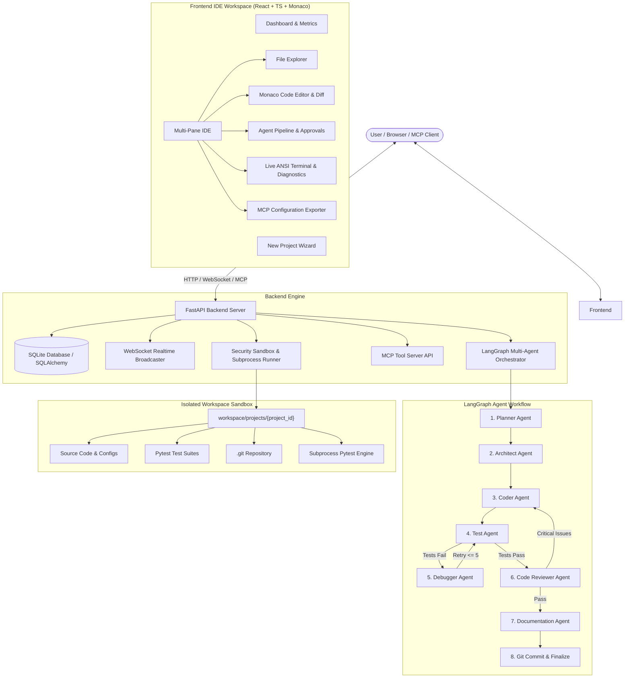

# 🤖 Autonomous AI Software Engineer Agent

[](https://fastapi.tiangolo.com)
[](https://reactjs.org)
[](https://langchain.com)
[](https://pytest.org)
[](https://microsoft.github.io/monaco-editor/)
[](LICENSE)

An end-to-end, production-grade **Autonomous AI Software Engineer Agent** workspace. Given a natural-language requirement, the system autonomously **plans, designs, writes code, executes pytest suites, diagnoses test failures, modifies source code in automated debug loops, performs code review, generates documentation, and tracks Git commits** in an isolated sandbox.

---

## 🌟 Key Features

- **Multi-Agent Orchestration with LangGraph:** Dedicated specialized agents (**Planner**, **Architect**, **Coder**, **Tester**, **Debugger**, **Reviewer**, **Documenter**) connected through a stateful graph with conditional execution branches.
- **Genuine Subprocess & Pytest Execution:** Executes genuine `pytest` inside project workspaces, capturing standard output, errors, and tracebacks. Never pretends tests passed without actual execution.
- **Automated Debugging Loops:** When tests fail, the Debugger Agent inspects stack traces, diagnoses root causes, modifies source files, and re-executes tests up to the configured retry threshold (`MAX_DEBUG_ITERATIONS = 5`).
- **Modern Developer IDE Workspace (React + Monaco Editor):**
  - Interactive file tree explorer with custom file icons and live search.
  - Full-featured Microsoft Monaco Editor with syntax highlighting, language detection, and side-by-side **Diff Viewer**.
  - Real-time **Agent Activity Timeline** and active task indicators over WebSockets.
  - Integrated dockable **Live Terminal** with ANSI stream output, Pytest metrics, Code Review findings, and Git commit history.
- **Multi-Provider LLM & Zero-Setup Demo Mode:** Supports OpenAI (GPT-4o), Google Gemini (Gemini 1.5 Pro/Flash), and a deterministic **Demo Mode** requiring zero API keys for instant testing.
- **Human-in-the-Loop Approval Safeguards:** Automatically intercepts sensitive operations (package installations, file drops, external commands) and pauses for user sign-off (`Approve` / `Deny`).
- **Model Context Protocol (MCP) Tool Server:** Exposes standard MCP tools over HTTP/JSON-RPC for external clients like Cursor, Claude Desktop, and VS Code.
- **Automated Git Version Control:** Automatically creates atomic commits at each meaningful milestone (`Architect Blueprint`, `Implement Models & Routes`, `Add Test Suite`, `Debugger Fix`, `Code Review`, `Documentation`).
- **Export as ZIP:** One-click packaging and download of the complete generated codebase.

---

## 🏗️ Architecture Overview



---

## 🚀 Quick Start Guide

### Prerequisites
- Python 3.11+ (Python 3.11, 3.12, 3.13 supported)
- Node.js 18+ and npm
- Git

### 1. Clone & Setup Backend
```bash
# Navigate to backend directory
cd backend

# Install Python dependencies
pip install -r requirements.txt

# Start FastAPI backend server
python run.py
```
Backend API and WebSockets will be running at `http://127.0.0.1:8000`.

### 2. Setup & Start Frontend
```bash
# In a separate terminal, navigate to frontend directory
cd frontend

# Install npm packages
npm install

# Start Vite dev server
npm run dev
```
Frontend developer workspace will be accessible at `http://localhost:5173`.

---

## ⚙️ Environment Configuration

Create a `.env` file in the root or `backend/` directory (optional):

```env
# Server Settings
DEBUG=True
DATABASE_URL=sqlite+aiosqlite:///autonomous_agent.db

# Default LLM Provider (demo, openai, gemini)
DEFAULT_PROVIDER=demo

# OpenAI API Settings
OPENAI_API_KEY=sk-...
OPENAI_MODEL=gpt-4o

# Google Gemini API Settings
GOOGLE_API_KEY=AIzaSy...
GEMINI_MODEL=gemini-1.5-pro

# Security & Sandboxing
COMMAND_TIMEOUT_SECONDS=30
MAX_OUTPUT_SIZE_BYTES=200000
AUTO_APPROVE_SAFE_COMMANDS=True
```

---

## 🧪 Running Automated Tests

Run the full backend test suite covering security path bounds, tool executors, agent state graphs, and REST APIs:

```bash
pytest backend/tests -v
```

---

## 🔌 Model Context Protocol (MCP) Integration

This application acts as an MCP tool server. External MCP clients such as **Claude Desktop**, **Cursor**, or custom AI agents can connect and control the autonomous engineer workspace.

### MCP Configuration (`claude_desktop_config.json`)
```json
{
  "mcpServers": {
    "autonomous-ai-engineer": {
      "url": "http://127.0.0.1:8000/api/mcp",
      "transport": "http"
    }
  }
}
```

### Exposed MCP Tools
1. `create_project_file`: Creates or updates files in project workspaces with path security checks.
2. `read_project_file`: Reads files from project workspaces.
3. `run_project_tests`: Executes pytest inside the project sandbox and returns structured results.
4. `get_project_structure`: Returns recursive workspace directory tree.
5. `execute_sandboxed_command`: Runs shell commands within strict timeouts and security boundaries.

---

## 🛡️ Security Architecture

The backend treats all generated code and shell commands as untrusted:
- **Path Traversal Protection:** Every file operation validates that resolved paths are strictly children of `workspace/projects/{project_id}`. Rejects `..`, absolute path escapes, and root drive jumps.
- **Command Security & Denylist:** Strictly blocks destructive commands (`rm -rf /`, formatting, credentials dumping, fork bombs).
- **Subprocess Isolation & Timeouts:** All commands execute inside project root with 30s timeout and output buffer capping (200KB) to prevent runaway memory leaks or infinite loops.
- **Human-in-the-Loop Interceptor:** Sensitive operations trigger real-time approval modals over WebSockets before execution.

---

## 💡 Example Prompts to Try

1. **FastAPI Task Management Service:**
   > *"Build a FastAPI REST API for a task management application with SQLite, CRUD operations, priority tagging, status filters, validation, unit tests and Swagger documentation."*

2. **Employee Management API:**
   > *"Build a FastAPI REST API for an employee management system with CRUD operations, SQLite database, Pydantic schemas, unit tests, and API documentation."*

3. **URL Shortener Microservice:**
   > *"Build a Flask REST API for a URL shortener service with SQLite storage, analytics tracking for click counts, input validation, and pytest test suite."*

---

## 📂 Project Directory Layout

```text
├── backend/
│   ├── app/
│   │   ├── main.py                  # FastAPI app entry & routers
│   │   ├── config.py                # Environment & defaults configuration
│   │   ├── database.py              # SQLite & SQLAlchemy engine
│   │   ├── models/                  # DB Models (Project, Run, Log, Test, Review, Commit, Approval)
│   │   ├── schemas/                 # Pydantic request & response schemas
│   │   ├── agents/                  # LangGraph Multi-Agent implementation
│   │   │   ├── state.py             # AgentState TypedDict
│   │   │   ├── graph.py             # LangGraph state graph compilation & edges
│   │   │   ├── planner.py           # Planner Agent
│   │   │   ├── architect.py         # Architect Agent
│   │   │   ├── coder.py             # Coder Agent
│   │   │   ├── tester.py            # Test Agent (Pytest)
│   │   │   ├── debugger.py          # Debugger Agent
│   │   │   ├── reviewer.py          # Code Reviewer Agent
│   │   │   ├── documenter.py        # Documentation Agent
│   │   │   └── mock_engine.py       # High-fidelity Deterministic Demo Engine
│   │   ├── tools/                   # Sandboxed tools (Filesystem, Pytest, Git, Subprocess)
│   │   ├── mcp/                     # MCP tool server implementation
│   │   ├── services/                # Business logic, WebSockets, LLM factory
│   │   └── routes/                  # REST & WebSocket API endpoints
│   ├── tests/                       # Pytest test suite
│   ├── requirements.txt             # Backend dependencies
│   └── run.py                       # Server launcher
├── frontend/
│   ├── src/
│   │   ├── components/
│   │   │   ├── layout/              # Navbar & status indicators
│   │   │   ├── dashboard/           # Metrics, recent projects & demo launcher
│   │   │   ├── wizard/              # Project creation modal with presets
│   │   │   ├── ide/                 # FileExplorer, Monaco Editor, Timeline, Terminal, Pytest, Git
│   │   │   ├── settings/            # LLM API configuration & connection tester
│   │   │   └── mcp/                 # MCP config exporter & documentation
│   │   ├── services/                # Axios REST & WebSocket connection clients
│   │   ├── types/                   # TypeScript interfaces
│   │   ├── App.tsx                  # Main App state coordinator
│   │   ├── index.css                # Tailwind CSS styling & scrollbars
│   │   └── main.tsx                 # React DOM mount
│   ├── package.json
│   ├── vite.config.ts
│   └── tsconfig.json
├── workspace/                       # Isolated generated project directories
└── README.md
```

---

## 📄 License
MIT License. Free for open-source and commercial use.
